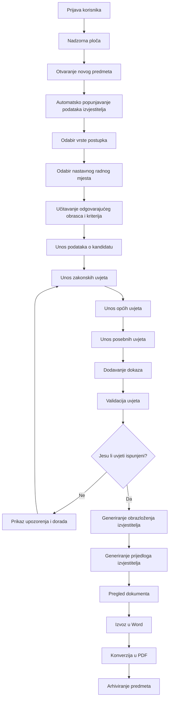
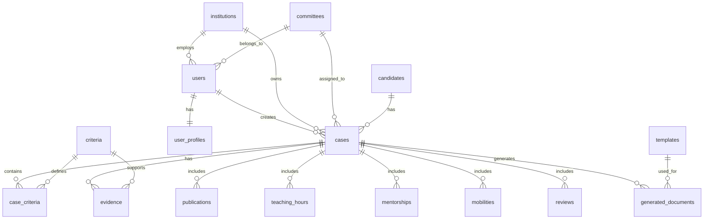

# Web aplikacija za izradu izvješća Matičnog povjerenstva

## 1. Opis projekta

Cilj projekta je izraditi web aplikaciju koja omogućuje strukturirano ispunjavanje obrazaca Matičnog povjerenstva za izbor ili reizbor nastavnika na veleučilištu.

Aplikacija treba zamijeniti ručno uređivanje Word dokumenata. Korisnik se prijavljuje u sustav, otvara novi predmet, odabire vrstu postupka i nastavno radno mjesto, unosi podatke o kandidatu i dokazima, a sustav na kraju automatski generira popunjeni Word dokument i PDF.

Posebno je važno da aplikacija automatski popunjava početne podatke izvjestitelja na temelju prijavljenog korisnika.

Primjer: ako se u sustav prijavi izvjestitelj doc. dr. sc. Alen Šimec, prof. struč. stud., aplikacija automatski popunjava polja:

* Matično povjerenstvo
* Izvjestitelj
* Datum
* Institucija/organizacija, ako je definirana u profilu korisnika
* Kontakt podaci izvjestitelja, ako su potrebni
* Zadane postavke dokumenta

Korisnik zatim dopunjava podatke o kandidatu i uvjetima.

---

## 2. Glavna ideja aplikacije

Aplikacija treba raditi kao čarobnjak kroz više koraka.

Korisnik ne bi trebao ručno tražiti koji obrazac treba koristiti. Nakon što odabere:

1. vrstu postupka,
2. nastavno radno mjesto,
3. područje i polje izbora,

sustav automatski učitava odgovarajući obrazac i prikazuje samo relevantne uvjete.

Na kraju aplikacija generira dokument koji odgovara službenom obrascu Matičnog povjerenstva.

---

## 3. Vrste postupaka koje aplikacija treba podržavati

Aplikacija treba podržavati najmanje sljedeće vrste postupaka:

* izbor na slobodno nastavno radno mjesto
* izbor na više nastavno radno mjesto
* reizbor na nastavno radno mjesto
* izbor ili reizbor u naslovnog nastavnika

---

## 4. Nastavna radna mjesta

Aplikacija treba podržavati obrasce za sljedeća nastavna radna mjesta:

* predavač
* viši predavač
* profesor stručnog studija
* profesor stručnog studija u trajnom izboru

Svako radno mjesto ima drukčije zakonske, opće i posebne uvjete.

---

## 5. Korisničke uloge

Sustav treba imati više korisničkih uloga.

### 5.1. Administrator

Administrator upravlja sustavom.

Može:

* dodavati korisnike
* uređivati korisničke profile
* dodavati i uređivati predloške obrazaca
* uređivati kriterije
* pregledavati sve predmete
* zaključavati ili arhivirati predmete

### 5.2. Izvjestitelj

Izvjestitelj je glavni korisnik aplikacije.

Može:

* otvoriti novi predmet
* unositi podatke o kandidatu
* označavati uvjete kao ispunjene ili neispunjene
* pisati obrazloženja
* dodavati dokaze
* generirati Word i PDF dokument
* arhivirati vlastite predmete

### 5.3. Član povjerenstva

Član povjerenstva može pregledavati predmet i davati komentare, ali ne mora imati pravo završnog generiranja dokumenta.

Može:

* pregledavati unesene podatke
* pregledavati dokaze
* unositi interne komentare
* predložiti izmjene

### 5.4. Preglednik

Preglednik ima samo pravo čitanja.

Može:

* otvoriti predmet
* pregledati dokumentaciju
* preuzeti generirani Word ili PDF

---

## 6. Login i korisnički profil

Aplikacija mora imati prijavu korisnika.

Svaki korisnik ima vlastiti profil. Podaci iz profila koriste se za automatsko popunjavanje početnog dijela dokumenta.

### 6.1. Podaci korisnika

U profilu korisnika treba spremiti:

* ime
* prezime
* titulu
* puno ime za ispis u dokumentu
* e-mail
* ulogu
* instituciju
* matično povjerenstvo
* područje matičnog povjerenstva
* zadani potpis, ako se koristi
* zadani datum ili automatski današnji datum
* status korisnika: aktivan/neaktivan

### 6.2. Primjer korisničkog profila

```text
Ime: Alen
Prezime: Šimec
Titula: doc. dr. sc.
Nastavno zvanje: prof. struč. stud.
Puni ispis: doc. dr. sc. Alen Šimec, prof. struč. stud.
E-mail: alen.simec@tvz.hr
Matično povjerenstvo: Matično povjerenstvo za područje društvenih znanosti
Institucija: Tehničko veleučilište u Zagrebu
Uloga: izvjestitelj
```

### 6.3. Automatsko popunjavanje dokumenta

Nakon prijave korisnika i otvaranja novog predmeta, aplikacija automatski popunjava početna polja dokumenta:

```text
Matično povjerenstvo za područje društvenih znanosti
Izvjestitelj: doc. dr. sc. Alen Šimec, prof. struč. stud.
Datum: [današnji datum]
```

Korisnik mora moći ručno izmijeniti automatski popunjene podatke ako je potrebno.

---

## 7. Osnovni tijek rada aplikacije



---

## 8. Nadzorna ploča

Nakon prijave korisnik dolazi na nadzornu ploču.

Na nadzornoj ploči treba prikazati:

* moje aktivne predmete
* predmete u izradi
* predmete koji čekaju provjeru
* završene predmete
* arhivirane predmete
* gumb za otvaranje novog predmeta

Primjer prikaza:

```text
-----------------------------------------------------
| Nadzorna ploča                                    |
-----------------------------------------------------
| Prijavljeni korisnik: doc. dr. sc. Alen Šimec     |
| Uloga: Izvjestitelj                               |
-----------------------------------------------------

[+ Novi predmet]

Moji predmeti:
-----------------------------------------------------
| Kandidat          | Postupak     | Zvanje | Status |
-----------------------------------------------------
| Neven Garača      | Reizbor      | Viši predavač | U izradi |
| Silvije Jerčinović| Izbor        | Profesor stručnog studija | Provjera |
-----------------------------------------------------
```

---

## 9. Otvaranje novog predmeta

Kod otvaranja novog predmeta korisnik unosi ili odabire osnovne podatke.

### 9.1. Podaci o predmetu

* kandidat
* veleučilište
* vrsta postupka
* nastavno radno mjesto
* naslovni nastavnik: da/ne
* slobodno radno mjesto: da/ne
* više radno mjesto: da/ne
* datum posljednjeg izbora/reizbora
* datum odluke o pokretanju postupka
* područje
* polje
* javni natječaj: da/ne, ako je primjenjivo

### 9.2. Automatska logika

Na temelju odabira aplikacija učitava odgovarajući skup kriterija.

Primjer:

```text
Vrsta postupka: Reizbor
Radno mjesto: Viši predavač
Polje: Ekonomija

Sustav učitava:
- zakonske uvjete za reizbor
- opće uvjete za višeg predavača
- posebne uvjete iz članka 10.
- minimalno 2 posebna uvjeta
```

---

## 10. Struktura obrasca

Svaki obrazac ima istu osnovnu strukturu:

1. osnovni podaci
2. zakonski uvjeti
3. opći uvjeti
4. posebni uvjeti
5. obrazloženje izvjestitelja
6. prijedlog izvjestitelja o ispunjavanju uvjeta
7. potpis izvjestitelja

---

## 11. Zakonski uvjeti

Zakonski uvjeti ovise o vrsti postupka i radnom mjestu.

Za svaki uvjet aplikacija treba prikazati:

* tekst uvjeta
* oznaku “da”
* oznaku “ne”
* polje za obrazloženje
* polje za dodavanje dokaza
* internu napomenu
* status provjere

Primjer:

```text
Uvjet:
Postupak reizbora pokreće se protekom pet godina od posljednjeg izbora odnosno reizbora.

[ ] da    [ ] ne

Obrazloženje:
____________________________________________________

Dokazi:
[Dodaj dokument]
```

---

## 12. Opći uvjeti

Opći uvjeti moraju biti ispunjeni svi.

Aplikacija mora jasno označiti ako neki opći uvjet nije ispunjen.

Primjer općeg uvjeta za višeg predavača:

```text
Uvjet:
Da je u prethodnom izbornom razdoblju osoba bila izabrana na nastavno radno mjesto višeg predavača odnosno u odgovarajućeg naslovnog nastavnika te je u tom svojstvu izvodila nastavu od najmanje 120 norma sati.

[ ] da    [ ] ne

Broj norma sati:
[________]

Automatska provjera:
- Ako je broj norma sati >= 120, sustav prikazuje: UVJET ISPUNJEN.
- Ako je broj norma sati < 120, sustav prikazuje: UVJET NIJE ISPUNJEN.
```

---

## 13. Posebni uvjeti

Posebni uvjeti ovise o odabranom zvanju i postupku.

Sustav mora znati minimalan broj posebnih uvjeta koji se mora ispuniti.

Primjeri:

```text
Predavač - reizbor: minimalno 2 posebna uvjeta
Viši predavač - reizbor: minimalno 2 posebna uvjeta
Profesor stručnog studija - izbor: minimalno 5 posebnih uvjeta
Profesor stručnog studija u trajnom izboru: minimalno 6 posebnih uvjeta
```

Aplikacija mora automatski brojati označene posebne uvjete.

Primjer prikaza:

```text
Posebni uvjeti:
Ispunjeno: 4 / Potrebno: 2

Status: UVJETI ISPUNJENI
```

Ako nije ispunjen dovoljan broj:

```text
Posebni uvjeti:
Ispunjeno: 1 / Potrebno: 2

Status: NEDOSTAJE JOŠ 1 POSEBNI UVJET
```

---

## 14. Modul za radove

Modul za radove jedan je od najvažnijih dijelova aplikacije.

Za svaki rad treba omogućiti unos:

* autori
* naslov rada
* godina objave
* točan datum objave, ako je dostupan
* vrsta rada
* časopis ili zbornik
* izdavač
* stranice
* ISSN/ISBN
* CROSBI ID
* CroRIS/CROSBI poveznica
* područje
* polje
* kategorija rada
* udio doprinosa kandidata
* računa se kao 100 %: da/ne
* rad u koautorstvu sa studentom: da/ne
* dokaz o statusu studenta, ako je primjenjivo

### 14.1. Provjera razdoblja

Aplikacija mora provjeriti ulazi li rad u relevantno izborno razdoblje.

Primjer:

```text
Datum pokretanja postupka: 14.05.2026.
Relevantno razdoblje: 14.05.2021. - 14.05.2026.
Godina rada: 2021.
Točan datum objave: nije unesen

Upozorenje:
Rad je iz 2021. godine, ali nije unesen točan datum objave.
Potrebno je provjeriti je li rad objavljen nakon 14.05.2021.
```

---

## 15. Modul za nastavnu aktivnost

Za nastavnu aktivnost aplikacija treba omogućiti unos:

* akademska godina
* kolegij
* studij
* broj norma sati
* dokaz o izvođenju nastave

Sustav automatski zbraja norma sate.

Primjer:

```text
Kolegij: Osnove ekonomije
Akademska godina: 2023./2024.
Norma sati: 120

Ukupno norma sati: 2.370
Propisani minimum: 120
Status: UVJET ISPUNJEN
```

---

## 16. Modul za mentorstva

Za mentorstva treba omogućiti unos:

* ime i prezime studenta
* naslov završnog ili diplomskog rada
* vrsta rada
* datum obrane
* studij
* područje/polje
* dokaz

Sustav automatski broji mentorstva.

Primjer:

```text
Broj mentorstava: 12
Propisani minimum: 7
Status: UVJET ISPUNJEN
```

---

## 17. Modul za međunarodnu mobilnost

Za međunarodnu mobilnost treba omogućiti unos:

* naziv ustanove
* država
* program mobilnosti
* početni datum
* završni datum
* broj dana
* broj sati nastave
* vrsta mobilnosti
* dokaz

Primjer automatske provjere:

```text
Broj dana: 5
Broj sati nastave: 8
Propisani minimum: 6 sati nastave ili 3 dana usavršavanja
Status: UVJET ISPUNJEN
```

---

## 18. Modul za recenzije

Za recenzije treba omogućiti unos:

* naziv časopisa ili zbornika
* naslov recenziranog rada
* godina
* područje
* polje
* dokaz o recenziji

Sustav automatski broji recenzije.

Primjer:

```text
Broj recenzija: 7
Propisani minimum: 3
Status: UVJET ISPUNJEN
```

---

## 19. Modul za dokaze

Svaki uvjet može imati jedan ili više dokaza.

Dokazi mogu biti:

* PDF
* DOC/DOCX
* slike
* potvrde
* odluke
* poveznice
* skenirani dokumenti

Za svaki dokaz treba spremiti:

* naziv dokaza
* vrstu dokaza
* datoteku
* uvjet kojem pripada
* komentar
* datum dodavanja
* korisnika koji je dodao dokaz

Primjer:

```text
Uvjet: 10.5. Međunarodna mobilnost
Dokaz: Mobility Agreement
Datoteka: mobility_agreement.pdf
Status: priloženo
```

---

## 20. Automatska validacija

Sustav mora prije generiranja dokumenta provjeriti:

* jesu li uneseni osnovni podaci
* jesu li ispunjeni svi zakonski uvjeti
* jesu li ispunjeni svi opći uvjeti
* je li ispunjen minimalni broj posebnih uvjeta
* imaju li radovi CROSBI ID
* ulaze li radovi u relevantno razdoblje
* jesu li priloženi dokazi
* je li unesen CroRIS/CROSBI profil
* je li za radove sa studentima priložena potvrda o statusu studenta
* je li obrazloženje izvjestitelja uneseno
* je li prijedlog izvjestitelja unesen

Primjer upozorenja:

```text
Upozorenja:
- Rad iz 2021. nema točan datum objave.
- Nije priložena potvrda o statusu studenta za rad u koautorstvu sa studentom.
- Posebni uvjeti: ispunjeno 1 od potrebna 2.
```

---

## 21. Generiranje obrazloženja izvjestitelja

Aplikacija treba automatski sastaviti nacrt obrazloženja na temelju označenih uvjeta.

Korisnik ga mora moći ručno urediti.

Primjer automatski generiranog teksta:

```text
Uvidom u dostavljenu dokumentaciju utvrđeno je da pristupnik ispunjava opće i potrebne posebne uvjete za izbor odnosno reizbor na nastavno radno mjesto. Pristupnik je u prethodnom izbornom razdoblju izvodio propisani broj norma sati nastave, ima javno dostupan CroRIS/CROSBI profil te je objavio radove relevantne za područje i polje izbora. Također, pristupnik ispunjava potrebne posebne uvjete koji su obrazloženi u pojedinim točkama izvješća.
```

---

## 22. Generiranje prijedloga izvjestitelja

Aplikacija treba omogućiti automatsko generiranje prijedloga.

Primjer:

```text
Predlažem da se utvrdi kako pristupnik ispunjava uvjete propisane Zakonom o visokom obrazovanju i znanstvenoj djelatnosti te Nacionalnim veleučilišnim kriterijima za izbor odnosno reizbor na nastavno radno mjesto.
```

---

## 23. Izvoz dokumenta

Aplikacija mora omogućiti:

* generiranje Word dokumenta
* konverziju Word dokumenta u PDF
* preuzimanje Word dokumenta
* preuzimanje PDF dokumenta
* arhiviranje generirane verzije

Dokument mora zadržati strukturu službenog obrasca.

---

## 24. Shematski prikaz korisničkog sučelja

```text
+------------------------------------------------------+
| WEB APLIKACIJA MATIČNOG POVJERENSTVA                |
+------------------------------------------------------+
| Prijavljeni korisnik: doc. dr. sc. Alen Šimec        |
| Uloga: Izvjestitelj                                  |
+------------------------------------------------------+

[1. Osnovni podaci] 
[2. Vrsta postupka] 
[3. Zakonski uvjeti] 
[4. Opći uvjeti] 
[5. Posebni uvjeti] 
[6. Dokazi] 
[7. Validacija] 
[8. Obrazloženje] 
[9. Izvoz]

--------------------------------------------------------
OSNOVNI PODACI
--------------------------------------------------------

Matično povjerenstvo:
[Matično povjerenstvo za područje društvenih znanosti]

Izvjestitelj:
[doc. dr. sc. Alen Šimec, prof. struč. stud.]

Datum:
[24.06.2026.]

Kandidat:
[________________________________]

Veleučilište:
[________________________________]

Polje:
[ekonomija]

Vrsta postupka:
[Reizbor ▼]

Nastavno radno mjesto:
[Viši predavač ▼]

[Spremi i nastavi]
```

---

## 25. Predložena struktura baze podataka

### 25.1. users

```sql
users
- id
- first_name
- last_name
- title
- teaching_title
- full_display_name
- email
- password_hash
- role
- institution_id
- committee_id
- is_active
- created_at
- updated_at
```

### 25.2. user_profiles

```sql
user_profiles
- id
- user_id
- default_reporter_name
- default_committee_name
- default_field
- default_institution
- phone
- signature_path
- notes
```

### 25.3. institutions

```sql
institutions
- id
- name
- address
- email
- type
- created_at
- updated_at
```

### 25.4. committees

```sql
committees
- id
- name
- scientific_area
- created_at
- updated_at
```

### 25.5. cases

```sql
cases
- id
- candidate_id
- reporter_id
- institution_id
- committee_id
- procedure_type
- academic_position
- title_teacher
- scientific_area
- scientific_field
- previous_election_date
- procedure_start_date
- public_competition
- status
- created_at
- updated_at
```

### 25.6. candidates

```sql
candidates
- id
- first_name
- last_name
- full_name
- academic_degree
- email
- institution
- croris_url
- previous_election_date
- notes
- created_at
- updated_at
```

### 25.7. criteria

```sql
criteria
- id
- academic_position
- procedure_type
- criterion_group
- criterion_number
- criterion_text
- minimum_value
- minimum_required_count
- is_required
- applies_to_field
- active
```

### 25.8. case_criteria

```sql
case_criteria
- id
- case_id
- criterion_id
- fulfilled
- explanation
- internal_note
- warning_note
- created_at
- updated_at
```

### 25.9. evidence

```sql
evidence
- id
- case_id
- criterion_id
- file_name
- file_path
- file_type
- description
- uploaded_by
- created_at
```

### 25.10. publications

```sql
publications
- id
- case_id
- title
- authors
- year
- publication_date
- publication_type
- journal_or_proceedings
- publisher
- pages
- issn
- isbn
- crosbi_id
- croris_url
- scientific_area
- scientific_field
- contribution_percentage
- counts_as_full_work
- coauthored_with_student
- student_status_evidence_id
- notes
```

### 25.11. teaching_hours

```sql
teaching_hours
- id
- case_id
- course_name
- academic_year
- study_program
- hours
- evidence_id
```

### 25.12. mentorships

```sql
mentorships
- id
- case_id
- student_name
- thesis_title
- thesis_type
- study_program
- defense_date
- scientific_area
- scientific_field
- evidence_id
```

### 25.13. mobilities

```sql
mobilities
- id
- case_id
- institution_name
- country
- mobility_program
- start_date
- end_date
- number_of_days
- teaching_hours
- mobility_type
- evidence_id
```

### 25.14. reviews

```sql
reviews
- id
- case_id
- journal_or_proceedings
- reviewed_title
- year
- scientific_area
- scientific_field
- evidence_id
```

### 25.15. generated_documents

```sql
generated_documents
- id
- case_id
- template_id
- docx_path
- pdf_path
- generated_by
- generated_at
```

### 25.16. templates

```sql
templates
- id
- name
- academic_position
- procedure_type
- file_path
- active
- created_at
- updated_at
```

---

## 26. Relacijski prikaz baze podataka



---

## 27. Statusi predmeta

Predmet može imati sljedeće statuse:

```text
draft        - u izradi
review       - na provjeri
completed    - završeno
archived     - arhivirano
returned     - vraćeno na doradu
```

---

## 28. Minimalni tehnički zahtjevi

Aplikacija može biti izrađena u sljedećoj tehnologiji:

### Backend

* PHP ili Laravel
* MySQL/MariaDB
* REST API, ako se koristi odvojeni frontend

### Frontend

* HTML
* CSS
* Bootstrap
* JavaScript
* jQuery ili Vue/React, ovisno o razini projekta

### Generiranje dokumenata

* DOCX template engine
* PHPWord ili slična biblioteka
* LibreOffice CLI ili drugi PDF konverter za pretvorbu DOCX u PDF

### Autentikacija

* login forma
* hashiranje lozinki
* role-based access control
* session management

---

## 29. Najvažnije funkcionalnosti za prvu verziju

Prva verzija aplikacije treba imati:

1. login korisnika
2. korisnički profil s predefiniranim podacima izvjestitelja
3. otvaranje novog predmeta
4. odabir vrste postupka i radnog mjesta
5. automatsko učitavanje kriterija
6. unos podataka o kandidatu
7. označavanje uvjeta “da/ne”
8. unos obrazloženja po svakoj točki
9. dodavanje dokaza
10. automatsko brojanje posebnih uvjeta
11. automatska upozorenja
12. generiranje obrazloženja izvjestitelja
13. generiranje prijedloga izvjestitelja
14. izvoz u Word
15. konverzija u PDF

---

## 30. Zaključak

Ova aplikacija ne treba biti samo obična forma za unos teksta. Ključni dio aplikacije je sustav pravila koji zna koji se kriteriji primjenjuju na određeno nastavno radno mjesto i određenu vrstu postupka.

Najvažnije funkcionalnosti su:

* prijava korisnika
* automatsko popunjavanje početnih podataka izvjestitelja
* dinamičko učitavanje odgovarajućeg obrasca
* unos i provjera uvjeta
* povezivanje dokaza s pojedinom točkom
* validacija minimalnih uvjeta
* generiranje Word i PDF dokumenta

Na taj način aplikacija smanjuje mogućnost pogreške, ubrzava izradu izvješća i omogućuje standardizirano ispunjavanje obrazaca Matičnog povjerenstva.
